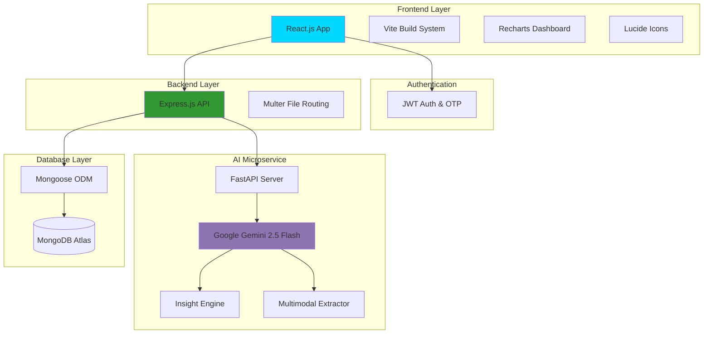
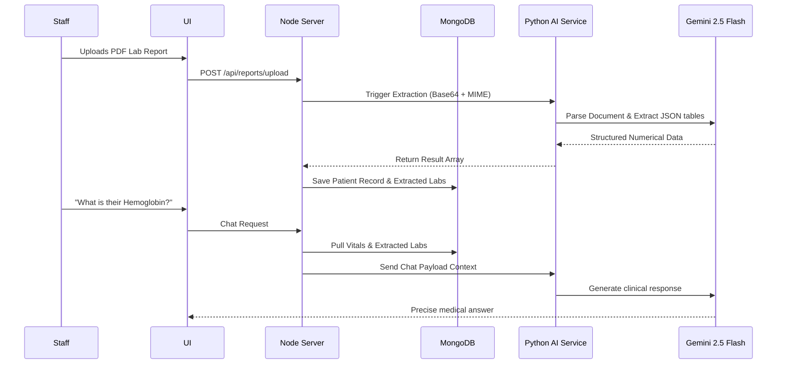
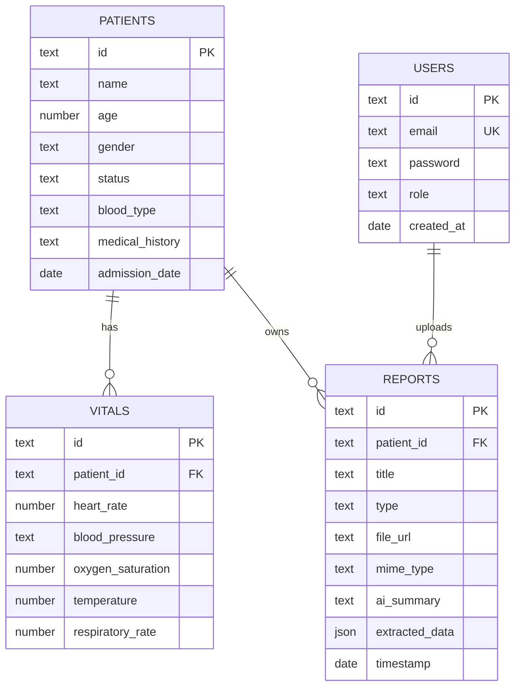

# Sentinel

> A comprehensive, AI-powered ICU management system for monitoring patient vitals, managing medical records, and receiving intelligent healthcare insights.

[](https://reactjs.org/)
[](https://nodejs.org/)
[](https://fastapi.tiangolo.com/)
[](https://www.mongodb.com/)
[](https://deepmind.google/technologies/gemini/)

## Overview

Sentinel is a production-ready, AI-powered Smart ICU Dashboard designed for modern healthcare facilities. It combines real-time patient monitoring, intelligent insights, and comprehensive medical record management in one seamless platform using a microservices-inspired architecture.

### Core Features

- **Smart Patient Monitoring** - Live vital signs tracking with historical trend visualization
- **Intelligent Insights** - Automated patient analysis and severity scoring using Gemini 2.5 Flash
- **Multimodal Document Extraction** - AI-powered ingestion of PDFs and Images into structured data
- **Medical Records Hub** - Secure document storage and categorical management
- **Conversational AI Assistant** - Context-aware clinical chat assistant powered by extracted lab data
- **Role-Based Security** - Custom JWT authentication with Admin and Staff access control

## Architecture



## AI Agent System

The application features a specialized multi-modal pipeline for clinical assistance and data extraction:



### AI Capabilities

**The Insight Engine**
- Continuously analyzes recent vital signs (Heart Rate, BP, O2, etc.)
- Calculates a Critical Index (0-100)
- Categorizes conditions into Critical, Warning, and Info alerts

**The Multimodal Document Extractor**
- Natively processes dense PDFs and clinical images
- Bypasses standard OCR by passing document binaries directly into Gemini's multimodal engine
- Formats unstructured documents into strict tabular JSON

## Database Schema



## Tech Stack

### Frontend
- **React.js 18** - UI Library
- **Vite** - Build tool and dev server
- **Recharts** - Data visualization
- **Lucide React** - Iconography

### Backend
- **Node.js & Express** - Primary API Gateway
- **MongoDB & Mongoose** - NoSQL Database and ODM
- **Multer** - File handling infrastructure
- **Nodemailer** - SMTP Client for Patient OTPs

### AI Service
- **Python 3.9+** - Microservice runtime
- **FastAPI** - High performance async API framework
- **Google Generative AI** - SDK for Gemini 2.5 Flash models

## Project Structure

```
Sentinel/
├── frontend/                     # React Application
│   ├── src/
│   │   ├── components/           # Reusable UI widgets
│   │   ├── context/              # React Context (Auth)
│   │   ├── pages/                # Route handlers (Dashboard, PatientDetail)
│   │   └── utils/                # Axios API configurations
│   └── package.json
├── backend/                      # Express Gateway
│   ├── controllers/              # Business logic (ai, auth, patients, reports)
│   ├── middleware/               # Auth guards and Multer config
│   ├── models/                   # Mongoose schemas
│   ├── routes/                   # HTTP route definitions
│   └── server.js                 # Application entry
└── ai-service/                   # Python FastAPI Microservice
    ├── main.py                   # Gemini integration and endpoints
    ├── requirements.txt
    └── .env                      # Gemini API definitions
```

## Key Features Deep Dive

### 1. Unified Insights and Contextual Chat

The platform synchronizes analytical data across its services to provide continuous context:

- AI models are fed immediate vital sign trends over the last 24 hours.
- Verified laboratory values from extracted documents are serialized into the system prompt.
- The Chatbot provides responses grounded entirely in the active mathematical context of the specific patient rather than generalized medicine.

### 2. Live Monitoring Dashboard

Visual data tracking with a focus on immediate triage:
- Glassmorphism design system ensures readability.
- Immediate visual indicators for abnormal metrics (e.g. flashing red typography for critical O2 saturation).
- Complete historical visualization through robust time-series graphs.

## Installation & Setup

### Prerequisites
- Node.js 18+
- Python 3.9+
- MongoDB (Atlas or Local)
- Google Gemini API Key

### Environment Configuration

**Backend (.env)**
```bash
MONGODB_URI="mongodb://localhost:27017/icu_dashboard"
JWT_SECRET="your_jwt_secret"
PORT=5000
```

**AI Service (.env)**
```bash
GEMINI_API_KEY="AIzaSy..."
PORT=8000
HOST="0.0.0.0"
```

### Installation Steps

```bash
# 1. Clone the repository
git clone https://github.com/Soura149/Sentinel.git
cd Sentinel

# 2. Start Backend
cd backend
npm install
npm run dev

# 3. Start AI Service
cd ../ai-service
python -m venv venv
venv\Scripts\activate   # (or source venv/bin/activate on Mac/Linux)
pip install -r requirements.txt
uvicorn main:app --reload

# 4. Start Frontend
cd ../frontend
npm install
npm run dev
```

Visit `http://localhost:5173` to access the application.

## Default Administrative Credentials

Note: Please change these upon deployment.
- **Email:** admin@icu.com
- **Password:** admin123
